<div align="center">


# MindSage

### Offline-first AI journaling for the desktop

**Write, speak, search, and reflect with local AI. Your entries, your models, your machine.**

[](https://github.com/Arinaymaybhaskar/MindSage_desktop_app/actions/workflows/ci.yml)
[](https://github.com/Arinaymaybhaskar/MindSage_desktop_app/releases)
[](https://www.electronjs.org/)
[](https://react.dev/)
[](https://www.typescriptlang.org/)
[](#what-runs-on-your-machine)

[Download](#download) · [Features](#features) · [Architecture](#architecture) · [Benchmarks](#performance-and-benchmarking) · [Development](#development) · [FAQ](#faq)

</div>

<br />

<div align="center">
  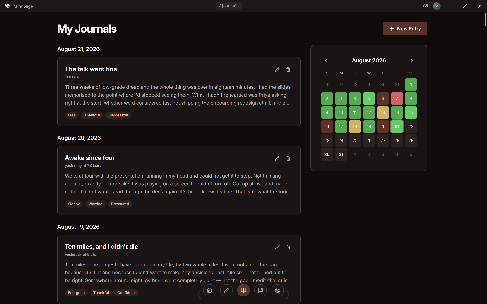
</div>

<br />

**MindSage is a private, offline AI journaling app.** It combines a writing tool, a voice recorder, a semantic search engine, and a retrieval-augmented chatbot into one desktop application, and it runs every one of those on your own hardware. Journal text is stored in a local SQLite database. Embeddings are generated by a local model and indexed in a local vector store. Speech is transcribed by a local Whisper build. There is no account server, no analytics pipeline, and no request that carries your writing anywhere.

Most journaling apps that offer AI features do so by shipping your most private writing to a third-party API. MindSage is a demonstration that the whole feature set is achievable without that trade, and this repository documents how.

---

## Table of contents

- [Download](#download)
- [Features](#features)
- [What runs on your machine](#what-runs-on-your-machine)
- [What touches the network](#what-touches-the-network)
- [Architecture](#architecture)
- [Engineering decisions](#engineering-decisions)
- [Performance and benchmarking](#performance-and-benchmarking)
- [Development](#development)
- [Project structure](#project-structure)
- [Roadmap](#roadmap)
- [Documentation](#documentation)
- [FAQ](#faq)
- [License](#license)

---

## Download

### Windows

[**Download the latest release**](https://github.com/Arinaymaybhaskar/MindSage_desktop_app/releases/latest) from the releases page, or take the direct installer link below.

[MindSage Setup for Windows (.exe)](https://github.com/Arinaymaybhaskar/MindSage_desktop_app/releases/download/v0.1.0-win/MindSage.Setup.1.0.0.exe)

> **SmartScreen warning.** The installer is not yet code-signed, so Windows will show a "Windows protected your PC" dialog. Choose **More info**, then **Run anyway**. Code signing is tracked as a release blocker in [docs/PRODUCTION_READINESS.md](docs/PRODUCTION_READINESS.md).

### macOS and Linux

Not yet distributed as an installer. The Electron build targets exist (`dmg` and `AppImage`) and the macOS Qdrant binary is bundled, but the platform has not been through signing, notarisation, or a CI matrix. See [docs/MAC_RELEASE_PLAN.md](docs/MAC_RELEASE_PLAN.md) for the remaining work. Building from source is covered under [Development](#development).

### First run

MindSage needs [Ollama](https://ollama.com) installed to serve local models. The onboarding flow detects whether Ollama and the required models are present and walks you through provisioning them. This one step needs a network connection; everything after it does not. See [What touches the network](#what-touches-the-network).

---

## Features

### Write

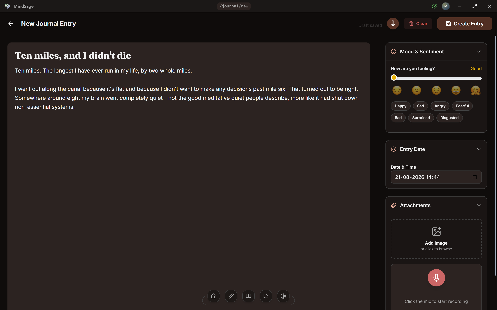

A distraction-light editor with a collapsible sidebar for everything that is not prose: mood score, mood tags, entry date and time, image attachments, and audio recording. Drafts autosave as you type. The entry date is editable, so a journal written on Tuesday about Sunday files itself under Sunday.

**Inline AI autocomplete** runs against a local model and renders as ghost text after the cursor. Press <kbd>Tab</kbd> to accept the whole suggestion, or <kbd>Ctrl</kbd> + <kbd>&rarr;</kbd> to take it one word at a time.

**Quick Capture** opens a small always-available window from anywhere in the operating system with <kbd>Ctrl</kbd> + <kbd>Alt</kbd> + <kbd>Space</kbd> (<kbd>Cmd</kbd> + <kbd>Option</kbd> + <kbd>Space</kbd> on macOS), for the thought you need to record before it disappears.

### Enrich, in the background

Saving an entry never waits on a model. The save returns immediately and an event goes onto an internal bus; a worker thread then generates a title, a mood score, mood tags, and a summary, and writes the embedding into the vector index. The entry shows a live status while that happens, and any stage that fails can be retried from the UI rather than silently leaving a blank field.

### Recall

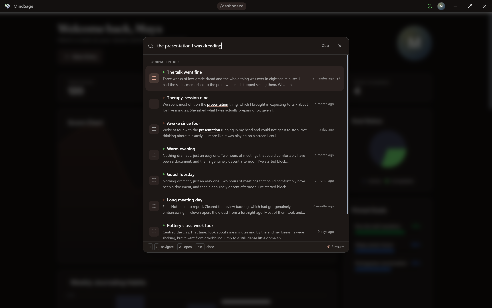

<kbd>Ctrl</kbd> + <kbd>F</kbd> opens a command palette that searches across journal entries, goals, progress logs, app actions, and settings pages at once. It runs keyword matching and **local semantic search** side by side, so the query above finds an entry titled "The talk went fine" that shares none of its words.

Semantic search works by embedding the query with `nomic-embed-text:v1.5` through Ollama, querying a local Qdrant index for nearest neighbours, and hydrating the resulting IDs back out of SQLite. Nothing about the query leaves the machine.

### Ask

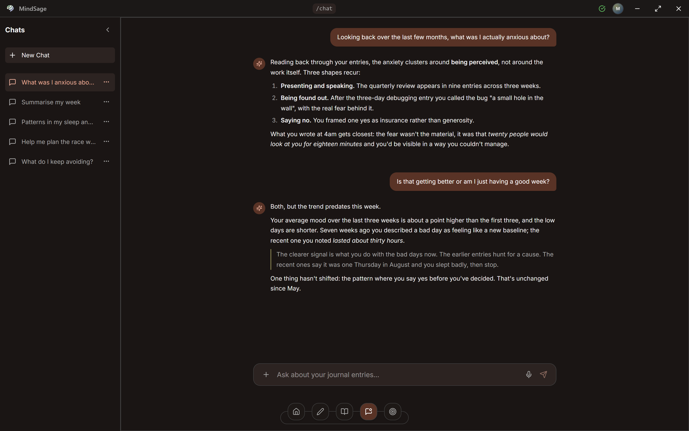

A retrieval-augmented chatbot grounded exclusively in your own entries. It retrieves the relevant journals, answers from them, and cites what it used. There is no external knowledge injection and no browsing; if the answer is not in your journal, it says so.

Replies **stream token by token**, and because the generation is two sequential model calls, the main process also reports which stage it is in (thinking, then searching, then writing) so the first few seconds are legible rather than blank.

### Reflect

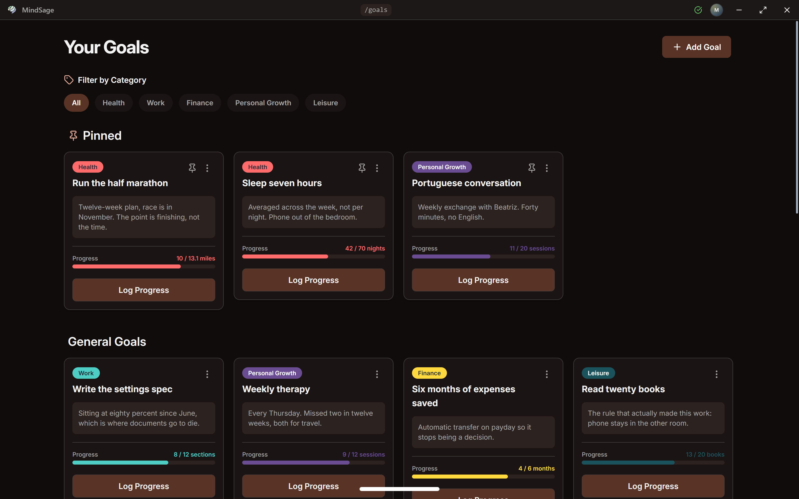

**Goals and ambitions.** Create goals by hand, or describe a high-level ambition and have a local model decompose it into concrete goals. Log progress with notes, group goals into colour-coded categories, pin the important ones to the dashboard, and review a progress chart when one is completed.

**Dashboard.** A bento grid of purpose-built tiles rather than a wall of generic charts: a streak ring, a mood heatmap, a sentiment trend, headline counters, pinned goal progress, and a strip of recent entries.

**Memories.** Every image you have ever attached to an entry, on its own page, rendered through a lazy thumbnail loader backed by a disk cache so a long wall costs only what is on screen.

### Speak

Two independent paths, both fully offline.

**Live speech to text** transcribes directly into the editor as you talk, with no file conversion step.

**Audio journals** are recorded and stored locally as WebM, then transcribed by a background pipeline:

```
WebM (MediaRecorder)  ->  FFmpeg  ->  WAV 16 kHz mono  ->  whisper.cpp  ->  transcript
```

The journal entry is updated with the transcript when it completes, and the detail view plays the audio alongside the text.

### Everything else

- **Themes and colour presets** with live application, plus a zoom control that takes effect without a reload.
- **Model settings** for choosing which local models handle chat, decisions, and embeddings.
- **Data export** to a ZIP archive containing structured JSON plus every attached image and audio file. It is your data, and it leaves in a format you can read.
- **Keyboard shortcuts** throughout, listed under <kbd>Ctrl</kbd> + <kbd>.</kbd>

---

## What runs on your machine

| Layer | Component | Notes |
| --- | --- | --- |
| Shell | Electron 37, Node ESM main process | One installable binary, no services to run |
| Interface | React 19, TypeScript, Tailwind CSS v4, Vite 7 | HashRouter, React Context for state, Recharts and Chart.js for visuals |
| Structured store | SQLite via `better-sqlite3` | Journals, goals, categories, progress logs, settings, chat history |
| Vector store | Qdrant, bundled binary, started on a free port at launch | Embeddings plus a minimal payload; IDs hydrate from SQLite |
| Text generation | Ollama, `llama3.2` by default | Titles, mood scoring, tags, summaries, goal decomposition, chat, autocomplete |
| Embeddings | `nomic-embed-text:v1.5` via Ollama, 768 dimensions | Roughly 274 MB, pulled once on first run |
| Speech to text | whisper.cpp with `ggml-tiny.en.bin` | Roughly 75 MB, bundled, CPU only, no GPU required |
| Audio conversion | FFmpeg via `ffmpeg-static` | WebM container to 16 kHz mono WAV |

Native binaries for Qdrant and whisper.cpp ship in `resources/` and are resolved differently in development and in a packaged build.

---

## What touches the network

A privacy claim is only worth what it can be checked against, so here is the full outbound picture, audited in [docs/NETWORK_AUDIT.md](docs/NETWORK_AUDIT.md).

**Never leaves the device:** journal text, titles, summaries, mood scores and tags, images, audio recordings, transcripts, embeddings, search queries, chat messages, and goals. Every model call is a request to `localhost`.

**Does use the network:**

| What | When | Control |
| --- | --- | --- |
| Ollama embedding model pull, roughly 274 MB | First run, if `nomic-embed-text:v1.5` is absent | Required once for semantic search to work at all |
| Ollama installer download | Only if you ask onboarding to install it | User initiated |
| Update check against GitHub Releases | Every launch of a packaged build | **Currently not gated behind a setting.** This is a tracked defect, not a design choice; see [NETWORK_AUDIT.md §1.1](docs/NETWORK_AUDIT.md) |

Typefaces are bundled with the application rather than fetched, so there are no font CDN requests at launch. Analytics, telemetry, and crash reporting do not exist in the codebase.

**Not yet true:** the SQLite database is not encrypted at rest. It lives at `%APPDATA%/MindSage/mind-sage.db` on Windows, and anyone with file access to your machine can read it. Encryption at rest is the top item in [docs/PRODUCTION_READINESS.md](docs/PRODUCTION_READINESS.md).

---

## Architecture

Three layers, with a strict boundary between them.

<picture>
  <source media="(prefers-color-scheme: dark)" srcset="./assets/diagrams/architecture-dark.svg">
  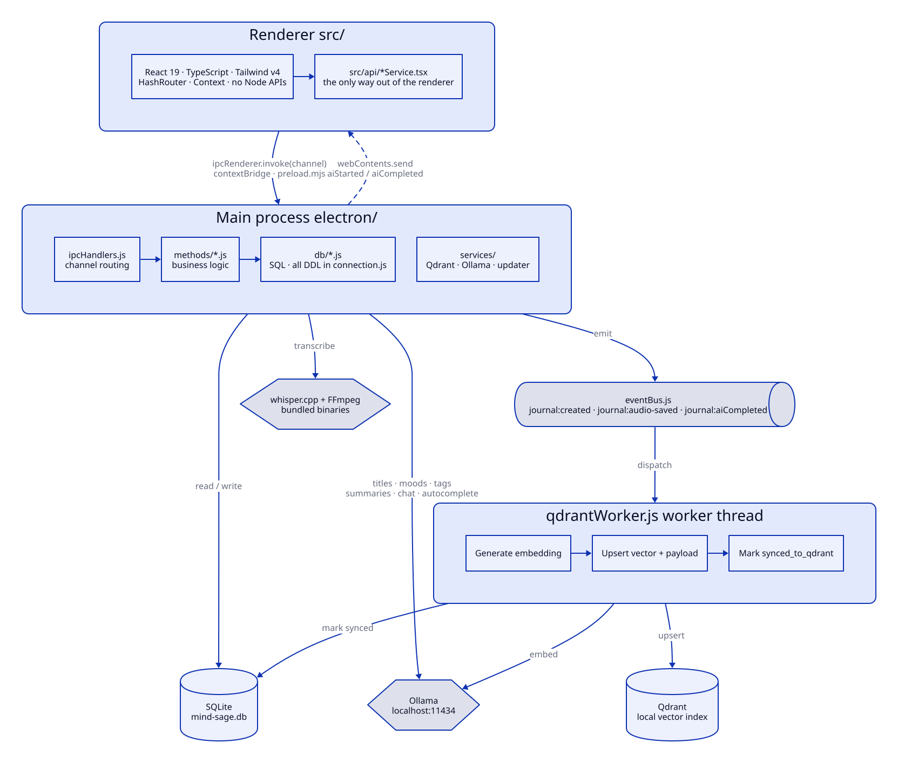
</picture>

**Request flow.** A UI component calls a service wrapper in `src/api/`, which invokes an IPC channel. [electron/ipcHandlers.js](electron/ipcHandlers.js) routes the channel to a handler in `electron/methods/`, which holds the business logic and reads or writes through `electron/db/`. The renderer never imports a Node API directly, which keeps the security boundary real rather than nominal.

**Background AI is event-driven.** Journal handlers emit on the event bus; a `Worker` thread performs enrichment and embedding, and completion is forwarded back to the renderer over `webContents.send`. AI metadata is therefore never available synchronously after a create or update, and the interface is designed around that rather than fighting it.

**Startup ordering** matters and is explicit: splash window, hidden main window, database initialisation, Ollama embedding-model setup, Qdrant launch on a free port, IPC handler registration, event bus wiring, worker spawn, then the main window is revealed on a `services-ready` signal.

### Saving an entry, end to end

This is the event-driven design above, in full. The save returns the moment the row is written. Four listeners then run independently: metadata, summary, embedding, and transcription when audio is attached. Nothing in the write path waits on a model, and any stage can fail without taking the entry with it.

<picture>
  <source media="(prefers-color-scheme: dark)" srcset="./assets/diagrams/create-journal-dark.svg">
  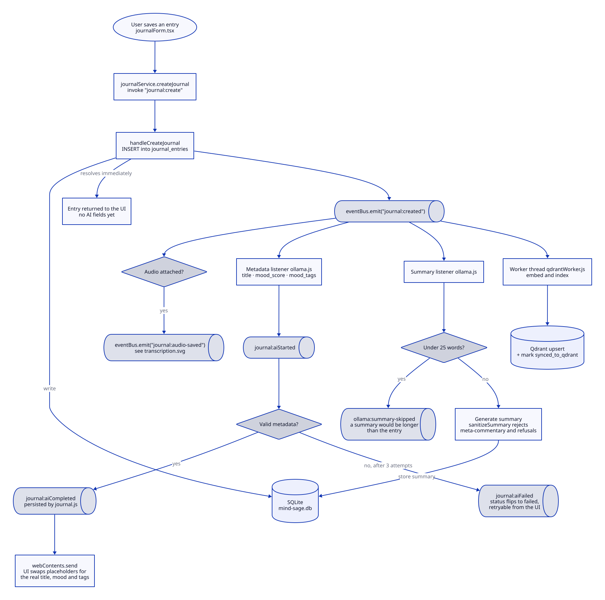
</picture>

### The other nine flows

Every diagram in this repository is generated from a [D2](https://d2lang.com) source file in [assets/diagrams/src/](assets/diagrams/src/), and each one describes a real code path, naming the files it was derived from at the top of the source. See [assets/diagrams/README.md](assets/diagrams/README.md) to re-render them.

They are collapsed below only to keep this page scannable. **Open any of them.**

<details>
<summary><strong>Journal lifecycle</strong>   update and delete   ·   2 diagrams</summary>

<br />

**Update.** What re-runs depends on which fields changed. A mood edit updates the Qdrant payload without re-embedding; a content edit re-embeds and regenerates the summary.

<picture>
  <source media="(prefers-color-scheme: dark)" srcset="./assets/diagrams/update-journal-dark.svg">
  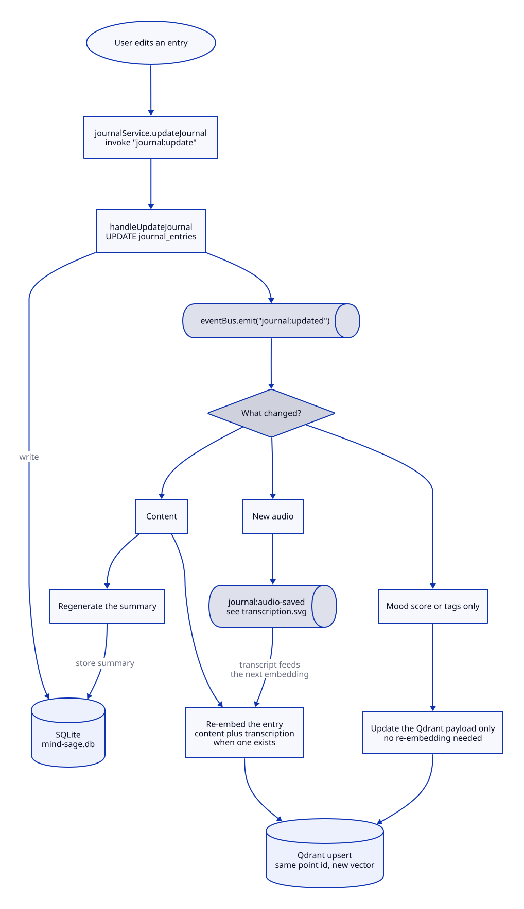
</picture>

**Delete.** The row is read before it is removed, so the attached media paths can be recovered and the files and vector point cleaned up alongside it.

<picture>
  <source media="(prefers-color-scheme: dark)" srcset="./assets/diagrams/delete-journal-dark.svg">
  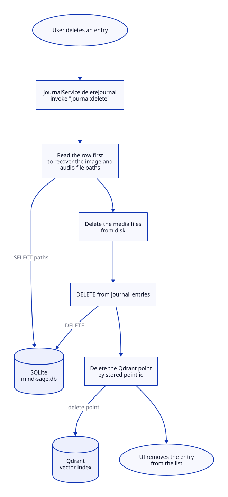
</picture>

</details>

<details>
<summary><strong>Voice</strong>   WebM to FFmpeg to whisper.cpp, all local   ·   1 diagram</summary>

<br />

WebM from the browser's MediaRecorder is not something whisper.cpp can read, so FFmpeg converts the container first. Everything here runs on the local CPU.

<picture>
  <source media="(prefers-color-scheme: dark)" srcset="./assets/diagrams/transcription-dark.svg">
  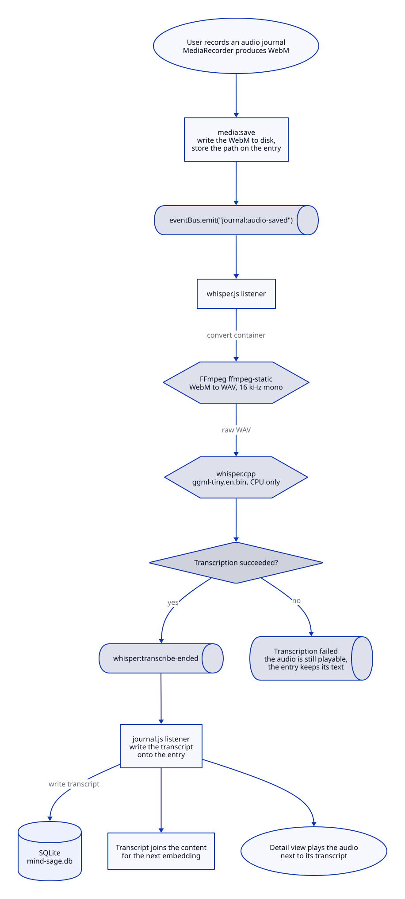
</picture>

</details>

<details>
<summary><strong>Search and chat</strong>   how retrieval over your own entries works   ·   2 diagrams</summary>

<br />

**Global search.** Keyword and semantic lookup run side by side and their results are merged, which is why a query can match an entry that shares none of its words.

<picture>
  <source media="(prefers-color-scheme: dark)" srcset="./assets/diagrams/semantic-search-dark.svg">
  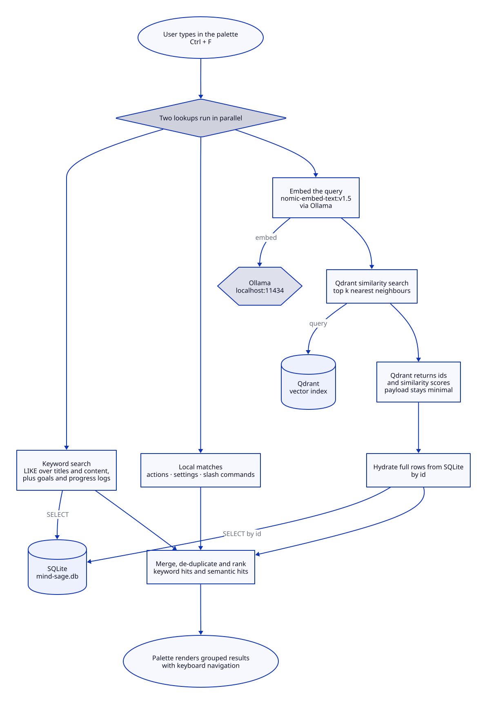
</picture>

**Retrieval-augmented chat.** Two sequential model calls. The first classifies the query and decides whether retrieval is needed; only the second one streams, which is why the interface reports a thinking and searching phase before any text appears.

<picture>
  <source media="(prefers-color-scheme: dark)" srcset="./assets/diagrams/chat-dark.svg">
  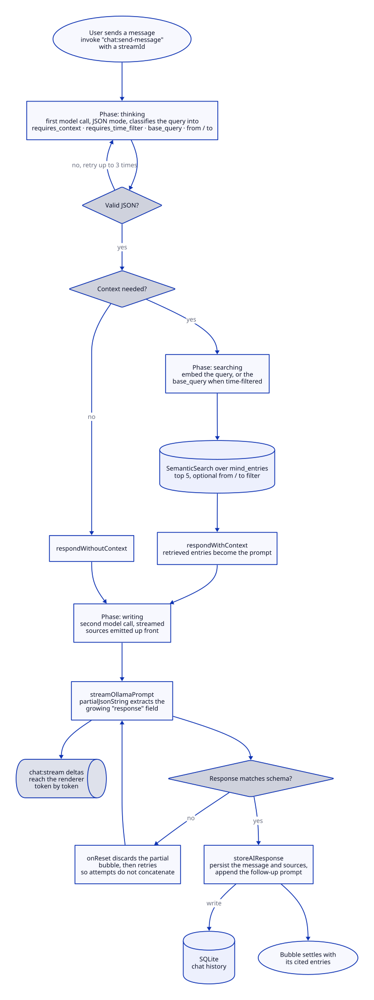
</picture>

</details>

<details>
<summary><strong>Goals</strong>   decomposing an ambition, then tracking it   ·   2 diagrams</summary>

<br />

**Creation.** An ambition is decomposed by two sequential local model calls, and nothing is written until the user has reviewed and edited the drafts.

<picture>
  <source media="(prefers-color-scheme: dark)" srcset="./assets/diagrams/create-goal-dark.svg">
  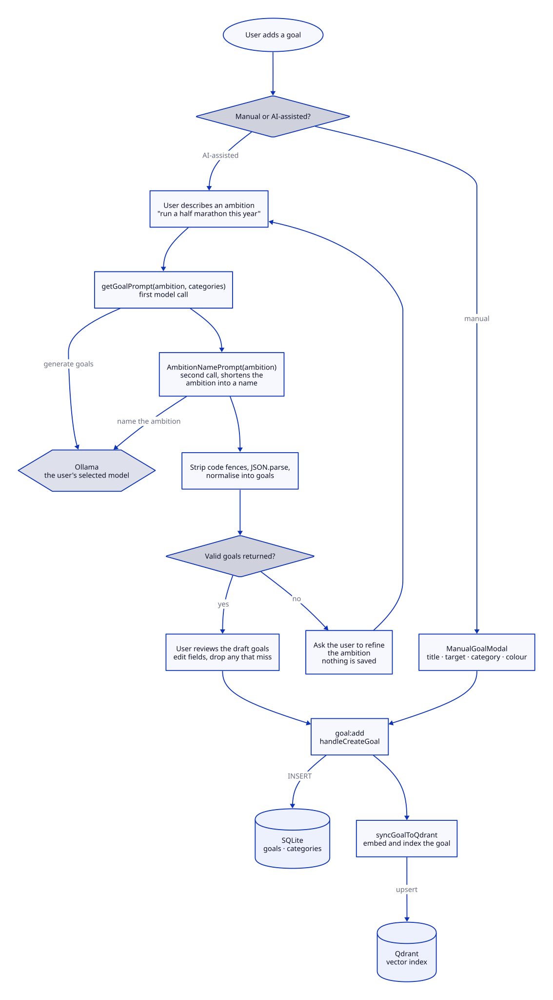
</picture>

**Progress, pinning, and completion.** Progress notes are embedded too, so a goal's history is searchable alongside journal entries.

<picture>
  <source media="(prefers-color-scheme: dark)" srcset="./assets/diagrams/goal-actions-dark.svg">
  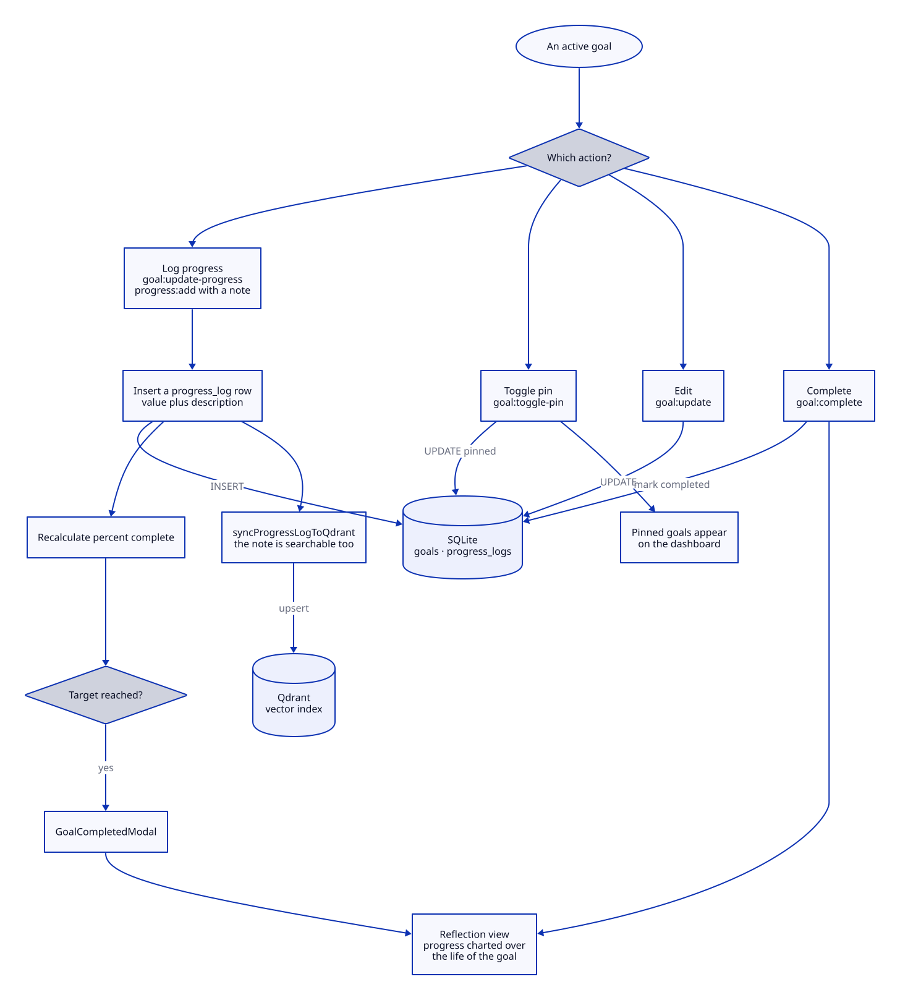
</picture>

</details>

<details>
<summary><strong>Infrastructure</strong>   resumable bulk indexing and first-run setup   ·   2 diagrams</summary>

<br />

**Bulk sync.** Rows are marked as they succeed, so an interrupted run resumes rather than starting over.

<picture>
  <source media="(prefers-color-scheme: dark)" srcset="./assets/diagrams/bulk-sync-dark.svg">
  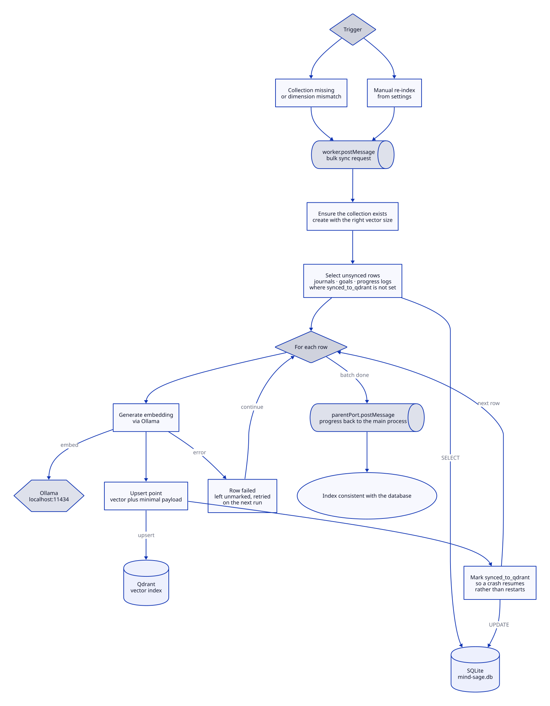
</picture>

**First-run setup.** The only part of MindSage that needs a network connection.

<picture>
  <source media="(prefers-color-scheme: dark)" srcset="./assets/diagrams/ollama-setup-dark.svg">
  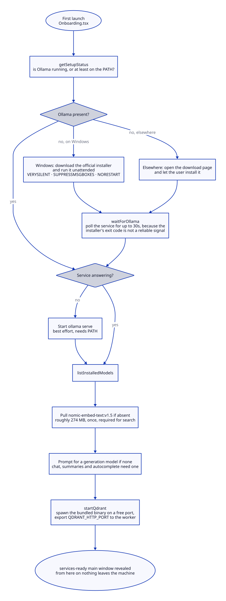
</picture>

</details>

---

## Engineering decisions

The reasoning behind each significant choice, including the trade-offs accepted and what would change at a different scale, is written up in **[docs/ARCHITECTURE.md](docs/ARCHITECTURE.md)**. In brief:

| Decision | Why |
| --- | --- |
| **Electron over Tauri** | The pipeline depends on Node native bindings (`better-sqlite3`, whisper.cpp). A Rust backend would have meant rewriting or bridging both. Chromium also guarantees consistent ContentEditable behaviour for the autocomplete keyboard handling, which system WebViews do not. |
| **Event bus over async chains** | Awaiting a multi-second transcription inside a React handler froze the interface, and an unavailable model could hang or corrupt an optimistic save. Decoupling intent from processing fixed both. |
| **Qdrant over ChromaDB or pgvector** | ChromaDB is Python-first with a less reliable local persistence story; pgvector needs a PostgreSQL install, which is an unacceptable burden for an offline desktop app. Qdrant runs as a single bundled binary with no Docker. |
| **SQLite alongside Qdrant, not one store** | Vector stores are built for nearest-neighbour search, not for "entries this month with mood above 7, ordered by date". Qdrant holds vectors and IDs; SQLite answers the relational questions in microseconds. |
| **whisper.cpp over cloud speech to text** | Voice journals are among the most sensitive data a person produces. Sending them to any API contradicts the product. The tiny English model is accurate enough on clear speech and needs no GPU. |
| **Local-only inference** | Earlier plans included a cloud fallback for long synthesis tasks. It is not wired into the desktop app, and the offline guarantee is stronger for its absence. |
| **No backend server** | Single user, single machine. The Electron main process is the backend. Fewer moving parts, no network-exposed API, no HTTP round trip for local reads. |

An Express and PostgreSQL sync backend exists at `src/server/`, left over from an online mode. **It is unreachable**, its entry point is commented out, and [docs/ONLINE_MODE_REMOVAL.md](docs/ONLINE_MODE_REMOVAL.md) judges deleting it safe. Do not build on it.

---

## Performance and benchmarking

Performance claims in this repository are measured rather than asserted. `npm run bench` runs an eleven-stage harness covering SQLite query latency at 150, 5,000, and 50,000 entries, `EXPLAIN QUERY PLAN` output, write throughput under worker contention, media handling, AI and retrieval quality, bundle size, and installed footprint.

```bash
npm run bench -- --label after-<change>              # measure
npm run bench -- --compare baseline --label after-<change>   # generate the delta table
npm run bench:board                                  # regenerate the status board
```

Results are versioned in [docs/benchmarks/](docs/benchmarks/README.md). [BASELINE.md](docs/benchmarks/BASELINE.md) is generated output and must never be hand-edited; [FINDINGS.md](docs/benchmarks/FINDINGS.md) is the written reading of it, and it corrects the earlier performance audit in two places. [OPTIMIZATION_LOG.md](docs/benchmarks/OPTIMIZATION_LOG.md) carries one row per issue with its measured before, the fix, and its measured after, so no improvement is claimed without a number attached to it.

The baseline run surfaced what the audit had only suspected: missing indexes on `journal_entries` produce 41 full table scans per run and near-linear latency growth, and read contention with the enrichment worker degrades a query that is otherwise instant by two orders of magnitude. Both are logged with measurements and are being worked through the ledger.

---

## Development

### Prerequisites

- **Node.js 20 to 24.** The repository pins 20 in `.nvmrc` and enforces the range with `engine-strict`.
- **[Ollama](https://ollama.com)**, running locally.
- **Windows** for the fully supported path. Qdrant and whisper.cpp binaries are bundled for Windows and macOS.

### Setup

```bash
git clone https://github.com/Arinaymaybhaskar/MindSage_desktop_app.git
cd MindSage_desktop_app
npm install          # postinstall rebuilds better-sqlite3 against Electron's ABI
npm run dev          # Vite dev server plus Electron
```

The `postinstall` rebuild is not optional. Without it `better-sqlite3` fails to load at runtime; run `npm run rebuild` if you ever hit that.

### Common commands

```bash
npm run dev          # development app
npm run build        # production build, installers land in release/
npm run release      # build and publish to GitHub Releases
npm test             # vitest run
npm run test:watch   # vitest in watch mode
npm run typecheck    # tsc on the renderer
npm run lint         # eslint
npm run format       # prettier --write
npm run bench        # benchmark suite
npm run seed:demo -- --reset   # populate a demo user
```

Run a single test file with `npx vitest run src/api/journalService.test.ts`, or one test by name with `npx vitest run -t "test name"`.

### Contributing

`main` is protected: no direct pushes, no force pushes, and a passing check is required to merge. Work happens on a branch and lands through a pull request. Branches follow the commit prefixes already in use: `feat/`, `fix/`, `chore/`, `docs/`, plus `backup/` for pre-rewrite snapshots and `archive/` for work kept but not merged.

Tests live next to the module they cover. In `electron/`, only pure modules are testable, since anything importing `better-sqlite3` or `electron` will not load under Vitest. A pre-commit hook runs `gitleaks protect --staged` against staged changes.

Before adding a pattern, read [docs/MASTER_TODO.md](docs/MASTER_TODO.md) and [docs/PRODUCTION_READINESS.md](docs/PRODUCTION_READINESS.md). They are candid about what is unfinished, and several items would be easy to make worse by accident.

---

## Project structure

```
MindSage_desktop_app/
├── electron/              Main process (Node ESM)
│   ├── main.js            Lifecycle, windows, startup ordering, global shortcut
│   ├── preload.js         contextBridge, emitted as preload.mjs
│   ├── ipcHandlers.js     Channel routing
│   ├── eventBus.js        Internal event bus
│   ├── qdrantWorker.js    Enrichment and embedding worker thread
│   ├── methods/           Business logic per domain
│   ├── db/                SQLite access; connection.js holds all DDL
│   └── services/          Qdrant manager, Ollama setup, app setup, auto-updater
├── src/                   Renderer (React 19 + TypeScript)
│   ├── api/               IPC wrappers, the only path to the main process
│   ├── pages/             Routed views
│   ├── components/        UI, grouped by domain
│   ├── context/           Auth, colour theme, toasts
│   └── server/            Unreachable legacy sync backend, slated for deletion
├── resources/             Bundled native binaries (Qdrant, whisper.cpp, models)
├── scripts/               Benchmarks, demo seeding, screenshot capture
├── docs/                  Audits, plans, benchmarks, and the work queue
└── assets/                Icons and architecture diagrams
```

New files under `electron/db`, `electron/methods`, or `electron/services` must be added to the `viteStaticCopy` targets in [vite.config.ts](vite.config.ts). They are loaded at runtime rather than bundled, so missing one breaks the packaged build while development keeps working.

---

## Roadmap

Ordered by what actually blocks a confident public release. The full queue lives in [docs/MASTER_TODO.md](docs/MASTER_TODO.md).

- Encryption at rest for the journal database
- Schema versioning, migrations, and a pre-migration backup
- Gating the update check behind an explicit setting
- Code signing for the Windows installer
- Indexes and WAL mode, measured through the optimisation ledger
- Deleting the unreachable sync backend
- macOS and Linux builds, signed and notarised
- Export to Markdown and PDF
- Improved semantic search ranking
- Bundle size reduction, targeting roughly 80 MB installed from 236 MB

---

## Documentation

| Document | What it covers |
| --- | --- |
| [docs/README.md](docs/README.md) | Index of every document below |
| [docs/MASTER_TODO.md](docs/MASTER_TODO.md) | The single ordered work queue |
| [docs/PRODUCTION_READINESS.md](docs/PRODUCTION_READINESS.md) | What stands between the code and a shippable product, with a verified-state table |
| [docs/ARCHITECTURE.md](docs/ARCHITECTURE.md) | Long-form reasoning behind each technical decision |
| [docs/NETWORK_AUDIT.md](docs/NETWORK_AUDIT.md) | Every outbound network path, with evidence |
| [docs/AUTH_REVIEW.md](docs/AUTH_REVIEW.md) | The authentication path, reviewed honestly |
| [docs/benchmarks/](docs/benchmarks/README.md) | The measurement harness and recorded results |
| [docs/COLOR_SYSTEM_README.md](docs/COLOR_SYSTEM_README.md) | Theming, presets, and the colour context API |
| [AGENTS.md](AGENTS.md) and [CLAUDE.md](CLAUDE.md) | Orientation for contributors and coding agents |

---

## FAQ

**Does MindSage work without an internet connection?**
Yes, for everything except first-run setup. Once Ollama and the embedding model are installed, writing, transcription, search, chat, and analysis all run offline. See [What touches the network](#what-touches-the-network) for the exact exceptions.

**Where is my journal stored?**
In a SQLite database in your user application data directory, `%APPDATA%/MindSage/mind-sage.db` on Windows, with media alongside it. It is a single file you can back up yourself.

**Is my data encrypted?**
Not yet. The database is a plain SQLite file, readable by anyone with access to your machine. Encryption at rest is the highest-priority open item.

**Which models does it use?**
`llama3.2` through Ollama for generation by default, configurable in settings; `nomic-embed-text:v1.5` for embeddings; and a bundled `ggml-tiny.en.bin` whisper.cpp build for speech.

**Do I need a GPU?**
No. Transcription runs on CPU. Generation speed depends on the Ollama model you choose, and smaller models are perfectly usable on a mid-range laptop.

**Can I get my data out?**
Yes. Settings has an export that produces a ZIP containing structured JSON plus every image and audio file you have attached.

**Is any of my writing used to train a model?**
No. Nothing is uploaded, so there is nothing to train on.

**Does it support macOS or Linux?**
Not as a distributed installer yet. You can build from source; see [Development](#development).

---

## License

No licence has been selected for this repository yet, which means default copyright applies and no usage rights are granted. A licence file is tracked as a release blocker.

---

<div align="center">

**MindSage** · offline AI journaling · local LLM · private journal app · Electron desktop app · semantic search · retrieval-augmented generation · speech to text · Ollama · Qdrant · whisper.cpp · SQLite

MindSage does not track its users. It helps them track themselves.

</div>
