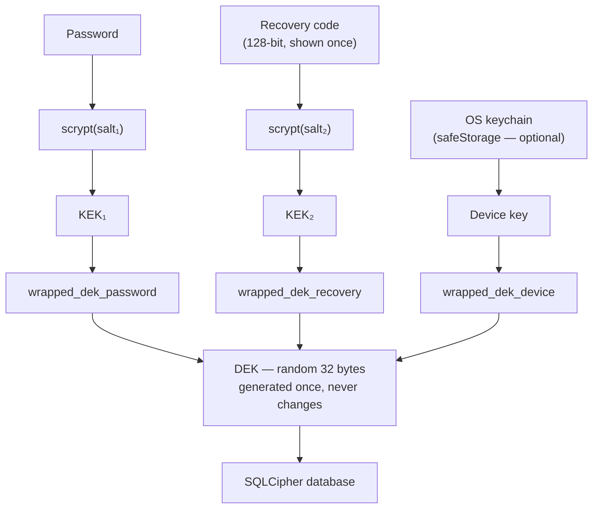

# MindSage — Offline Login & Recovery Design

**Written:** 2026-08-24 · **Status:** Proposal · **Supersedes:** the current auth flow reviewed in [AUTH_REVIEW.md](AUTH_REVIEW.md)

A concrete design for authentication in a fully offline app, and an honest answer to *"what happens when someone forgets their password?"*

---

## 1. The reframing

There is no server, so there is nobody to authenticate **to**. What the app actually needs is an **unlock**: turning ciphertext on disk into a usable journal.

That single change resolves most of the defects in [AUTH_REVIEW.md](AUTH_REVIEW.md):

| Today | Proposed |
| --- | --- |
| Password gates a React route | Password derives the key that decrypts the data |
| JWT issued, never verified | No tokens at all |
| Renderer sends a token to main on every call | Main process already knows who is unlocked |
| `password_hash` compared with bcrypt | Correct password proves itself — wrong keys fail decryption |
| "Logged in forever" | Locked on idle, on sleep, and on quit |

**The renderer never holds a key or a credential.** The trust boundary in Electron is main↔renderer, so the session lives in the main process and IPC handlers read it from there. Passing a token *from* the renderer *to* main — as the code does today — has the trust relationship backwards.

---

## 2. Threat model — state this in the UI, not just here

**Protects against:** a stolen laptop or drive, other OS accounts on the same machine, the DB file being swept into a cloud backup, and casual snooping by someone who opens the lid.

**Does not protect against:** malware running as the user while the vault is unlocked, an attacker who can modify the app binary, or a memory dump taken while unlocked.

Anything stronger requires an OS-level security boundary the app does not have. Claiming more than this would repeat the current mistake, where a `biometric_lock` toggle implies protection that does not exist.

---

## 3. Key hierarchy

The design rests on one idea: **encrypt the data once with a random key, then wrap that key several different ways.** Each wrapper is an independent way in. Adding a recovery path never weakens the others, and changing a password never re-encrypts a byte of journal data.



**Concretely:**

- **DEK** — 32 bytes from `crypto.randomBytes`. Created at first run, never rotated, never leaves the main process. Passed to SQLCipher as a raw key (`PRAGMA key = "x'<hex>'"`) so SQLCipher's own KDF is bypassed — the DEK is already uniformly random.
- **KDF** — `crypto.scrypt` with `N = 2^17, r = 8, p = 1` (~128 MB, a few hundred ms). **Recommended over Argon2id purely for operational reasons:** scrypt is built into Node, and this project already carries real pain rebuilding native modules against Electron's ABI ([AGENTS.md](../AGENTS.md)). Argon2id is the stronger primitive; adopt it if the native-dep cost is acceptable. Store the KDF name and parameters alongside the salt so they can be upgraded later.
- **Wrapping** — AES-256-GCM. The auth tag *is* the password check: a wrong password produces a failed tag, not a plausible-looking wrong key. No `password_hash` column is needed at all.
- **Vault metadata** — stored **outside** the encrypted DB (it has to be readable before unlock) in `vault.json` under `userData`: version, KDF params, salts, the three wrapped DEKs, and a `recovery_code_issued_at`. It contains no secret that is useful without a password or recovery code.

**Changing a password re-wraps the DEK.** It takes milliseconds and does not touch the journal.

---

## 4. Flows

### 4.1 First run — Setup

```
1. Welcome              → what MindSage is; "your journal never leaves this device"
2. Create profile       → display name, password (zxcvbn score ≥ 3, already implemented)
3. ⚠️ Recovery code     → 128-bit code, displayed ONCE
                          "Save this. It is the only way back into your journal
                           if you forget your password. We cannot reset it for you."
                          [Copy] [Save to file…] [Print]
4. Confirm              → re-enter 2 random groups from the code to prove it was saved
5. Generate + encrypt   → DEK created, DB initialised encrypted, vault.json written
```

Step 4 is not optional. Skipping confirmation is how users discover in six months that they never saved the code.

Format the code as Crockford base32 in groups — `K7M2Q-4XPRW-9HJ3T-…` — which excludes `I`, `L`, `O`, and `U` so it survives being written on paper and typed back.

### 4.2 Normal launch — Unlock

```
┌─────────────────────────────────┐
│         MindSage                │
│   ┌───────────────────────┐     │
│   │ Password              │     │
│   └───────────────────────┘     │
│   [ Unlock ]                    │
│                                 │
│   Use Windows Hello / Touch ID  │  ← only if device unlock was enabled
│   Forgot your password?         │
└─────────────────────────────────┘
```

The word is **Unlock**, not "Sign in" — there is no account anywhere to sign in to, and the wording sets the right expectation about recovery.

On success the main process holds `{ userId, dek }` in memory and opens the SQLCipher connection. Nothing is written to `localStorage`.

**If more than one profile exists**, show a profile picker first. With exactly one — the overwhelmingly common case — skip straight to the password field.

### 4.3 Forgot password

```
1. "Enter your recovery code"     → the 128-bit code from setup
2. Unwrap DEK via KEK₂            → wrong code fails the GCM tag; rate-limit attempts
3. "Choose a new password"        → re-wrap DEK with the new KEK₁
4. Issue a NEW recovery code      → the old one is invalidated and must be re-saved
5. Unlock and continue
```

Rotating the code in step 4 matters: a recovery code that has been used once has probably been read aloud, screenshotted, or emailed to the user themselves.

### 4.4 Both password and recovery code lost

**The data is gone. Say so, immediately and without hedging.**

```
We cannot recover this journal.

Your entries are encrypted with a key derived from your password and
your recovery code. We do not have a copy of either — that is what makes
the encryption meaningful.

You can start a new journal. Your existing file stays on disk in case you
find your recovery code later.
```

Do **not** offer to "try to recover it," and do not silently delete the old vault. Users find recovery codes months later.

This is the honest cost of real encryption, and it is why §4.1 step 4 and §5 exist.

### 4.5 Change password (from Settings)

Verify the current password, re-wrap the DEK, done. The recovery code is unaffected — it wraps the same DEK.

### 4.6 Lock

Lock on: idle timeout (default 15 minutes, configurable, "never" allowed with a clear warning), system sleep/lock, and app quit. Locking zeroes the DEK, closes the SQLCipher handle, and returns to §4.2.

Quick Capture must respect this: if the vault is locked, the global shortcut opens the unlock prompt, and **the typed draft is held in memory and saved after unlock** — never discarded. That directly fixes the data-loss bug in [PRODUCTION_READINESS.md](PRODUCTION_READINESS.md) §1.

---

## 5. The real safety net: backups

A recovery code protects against a forgotten password. It does not protect against a dead disk, a corrupted file, or a bad migration.

- Keep and promote the existing export feature ([exportData.js](../electron/db/exportData.js)). Surface it in onboarding, not buried in Settings.
- Offer **"Export an encrypted backup"** — the same ciphertext plus vault metadata, restorable with the password or recovery code.
- Offer **"Export readable copy"** (Markdown/JSON, plaintext) with an explicit warning that the file is unencrypted.
- Take an automatic pre-migration snapshot before any schema change (see [PRODUCTION_READINESS.md](PRODUCTION_READINESS.md) §1).

---

## 6. Data model changes

**New — `vault.json` in `userData` (unencrypted metadata, no usable secrets):**

```jsonc
{
  "version": 1,
  "kdf": { "name": "scrypt", "N": 131072, "r": 8, "p": 1 },
  "profiles": [{
    "userId": 1,
    "displayName": "Arinaymay",
    "passwordSalt":  "<base64>",
    "recoverySalt":  "<base64>",
    "wrappedDekPassword": "<base64 iv||ct||tag>",
    "wrappedDekRecovery": "<base64 iv||ct||tag>",
    "wrappedDekDevice":   "<base64 or null>",
    "recoveryCodeIssuedAt": "2026-08-24T00:00:00Z"
  }]
}
```

**Changed — `users` table:** drop `password_hash`. Correct decryption is the proof of identity.

**Removed entirely:** `generateAccessToken`, `offlineAccessTokenSecret`, every `getUserIdFromToken`, the `accessToken` / `authMode` / `userInfo` `localStorage` keys, and the `token` parameter on all ~68 IPC channels.

---

## 7. Migration for existing installs

Existing users have a plaintext DB and a bcrypt hash. On first launch of the new version:

1. **Back up first** — copy `mind-sage.db` to `mind-sage.db.pre-encryption-<timestamp>`. Do not delete it until step 5 succeeds and the user has confirmed they can unlock.
2. Prompt: *"MindSage now encrypts your journal. Enter your password to continue."*
3. Verify against the existing bcrypt hash — the last time bcrypt is ever used.
4. Generate the DEK, encrypt the database, write `vault.json`.
5. Show the recovery code with the same mandatory confirmation as §4.1.

If the user abandons at step 5, keep them on the old unencrypted path rather than leaving them with an encrypted vault whose only key is a password they may forget.

---

## 8. Alternatives considered and rejected

| Option | Why not |
| --- | --- |
| **Security questions** | Low entropy and often guessable by exactly the people you are hiding a journal from. A backdoor wearing a helpful hat. |
| **Email reset** | Needs a server and a network. Contradicts the entire product. |
| **Escrow the key with the vendor** | Then the vendor can read every journal. This is the one thing an offline journal must never do. |
| **No recovery at all** | Defensible, and some password managers ship it — but for a journaling app with non-technical users it guarantees permanent loss for a predictable share of them. |
| **Password hint only** | Harmless, near-useless. Fine as a small addition; not a recovery mechanism. |
| **Keep it unencrypted and skip all of this** | Legitimate *if* the app stops claiming privacy. The current state is the worst of both: the cost of a login screen with none of the protection. |

---

## 9. Implementation order

1. **Decide** — this design (encrypted vault) or the honest downgrade to profile-selection with no security claim. Everything below assumes the former.
2. **Ship the session refactor first, without encryption.** Move the session into the main process, delete the tokens, drop the `token` parameter from IPC. Behaviour-neutral, independently testable, and it removes the largest chunk of risk from the encryption change.
3. **Add the vault** — key hierarchy, setup wizard, recovery code, unlock screen.
4. **Turn on SQLCipher** and ship the §7 migration.
5. **Add lock states** — idle, sleep, quit — and wire Quick Capture into them.
6. **Implement `biometric_lock` for real**, or delete the toggle. It must not remain inert once the rest of this exists.
